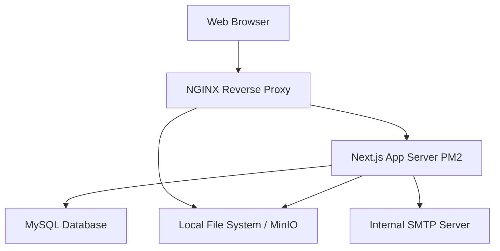

# Architecture Overview: On-Premise Deployment

This document outlines the architectural changes necessary to host the Saccoss Admin and Member platform entirely within a self-hosted (on-premise) environment.

## Goal

To deploy the platform locally for a single institution, completely removing the reliance on multi-tenancy and external cloud dependencies like Firebase.

## Current Cloud Architecture

Currently, the platform leverages several managed cloud services:

* **Web Framework:** Next.js (App Router)
* **Database:** MySQL via TypeORM
* **Authentication:** Firebase Auth
* **Storage:** Firebase Storage (for KYC documents, certificates, user profiles)
* **Multi-tenancy:** Hardcoded tenant identification (`tenantId`) spread across tables like `Tenant.ts` and query scopes.
* **External Comm Services:** Brevo SMTP (Email), SMS Portal API (SMS notifications).

## Target On-Premise Architecture

To run completely independently, the architecture must transition to self-hosted counterparts.

### 1. Application Server

* **Technology:** Node.js running the built Next.js application.
* **Process Manager:** PM2 or Docker to keep the Node.js application running, manage restarts, and handle application logging.
* **Reverse Proxy:** NGINX or Caddy. This will sit in front of the Next.js app to handle SSL/TLS termination, static file caching, and routing.

### 2. Database Server

* **Technology:** Self-hosted MySQL server (version 8+).
* **Changes:** No engine change needed, but the application points to the local/internal IP address instead of a cloud database.

### 3. Authentication (Replacing Firebase Auth)

Firebase Auth cannot be used offline or entirely on-premise without a connection to Google.

* **Proposed Solution:** Transition the authentication layer closely integrated into Next.js using **NextAuth.js (Auth.js)** with the *Credentials Provider*.
* **Storage:** User credentials (passwords hashed via `bcryptjs`, which is already in the `package.json`) will be stored directly in the local MySQL database's `User` table instead of relying on Firebase's User Records.

### 4. File Storage (Replacing Firebase Storage)

* **Proposed Solution 1 (Simple):** Local File System. Uploads are streamed via Next.js API routes and saved to a dedicated local directory (e.g., `/var/www/saccoss/uploads`). NGINX can serve these static files directly.
* **Proposed Solution 2 (Scalable):** **MinIO**. A high-performance, S3-compatible object storage server that runs on-premise. This is beneficial if the platform needs to scale horizontally across multiple application servers.

### 5. Single-Tenant Isolation

* Since this deployment is for a single institution, the global multi-tenant routing (e.g., `/[tenantId]/...` or evaluating `req.tenant`) must be disabled.
* The single tenant's configuration (like custom branding, names, settings) can be moved from the `Tenant` database table into environment variables or a single, hard-coded internal configuration record.

### 6. Notifications (Email & SMS)

* **Email:** Point the application to an internal corporate SMTP relay server instead of Brevo, allowing the system to send emails completely internally.
* **SMS:** If internet access is completely restricted, integration with a local SMS gateway hardware appliance (via SMPP or local HTTP API) will be necessary. If outbound internet is permitted, the existing SMS Portal can remain.

## Simplified Architecture Diagram

